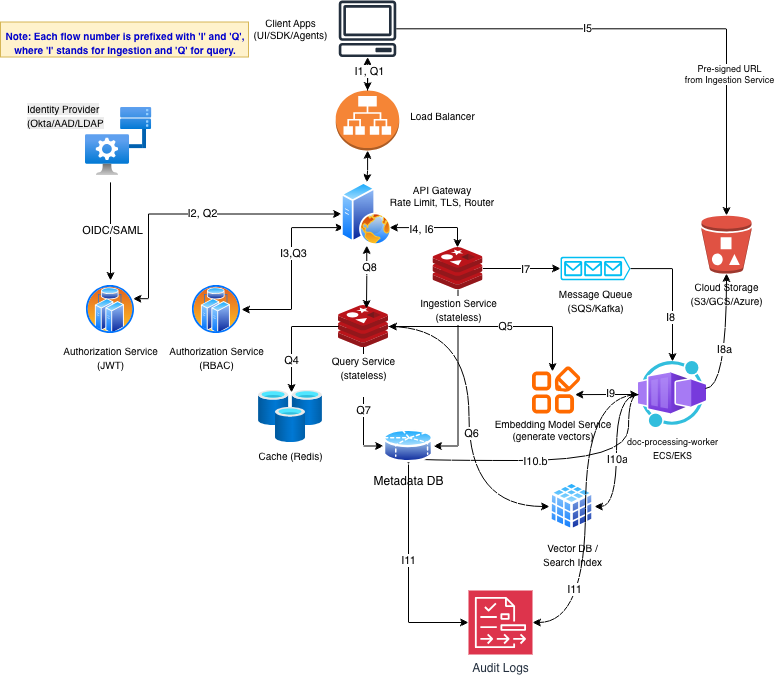

# Knowledge Indexing Service - System Design

## Table of Content
 [Knowledge Indexing Service](#knowledge-indexing-service)
  - [Introduction](#introduction)
  - [High Level Interactions](#high-level-interactions)
    - [Ingestion flow](#ingestion-flow)
    - [Query flow](#query-flow)
    - [API EndPoints](#api-endpoints)
    - [Data Model (Key Tables)](#data-model-(key-tables))
 - [MultiTenancy Strategy](#multitenancy-strategy)
    - [Data Isolation](#data-isolation)
    - [Database Design Approach](#database-design-approach)
    - [Network and API Isolation](#network-and-api-isolation)
 -  [Scalability and Caching](#scalability-and-caching)
 -  [Security and Compliance](#security-and-compliance)
 -  [Scalability and Caching](#scalability-and-caching)
    - [Identity, Authentication, and Authorization](#identity,-authentication,-and-authorization)
    - [Data Proctection](#data-proctection)
    - [Audit Logging](#audit-logging)
-   [Technology Stack Justification](#technology-stack-justification)

## Introduction
This design document outlines a highly scalable, multi-tenant knowledge indexing platform that enables enterprises to securely ingest, index, and retrieve large volumes of data, including PDFs, text files, and structured datasets. It supports high-throughput data ingestion and low-latency retrieval through semantic search powered by embeddings, complemented by traditional keyword search for accuracy and explainability.

Built with strict tenant isolation, robust security measures, and compliance-grade audit logging, the platform is suitable for regulated enterprise environments. Its architecture focuses on high availability, fault tolerance, and scalability, allowing seamless expansion from initial deployment to handling extensive multi-tenant enterprise workloads.

## High Level Interactions

### Ingestion flow
1. Client calls POST /documents to upload the PDF file.
2. User is authenticated, and tenant_id is resolved. A JWT token is created containing user_id, tenant_id, and other data.
3. Authorization service (RBAC) shares user-role-permission to validate Ingestion Service API access.
4. Ingestion Service returns a pre-signed object store URL for upload (keeping Ingestion Service stateless and scalable).
5. Client uploads the document to the object store using the pre-signed URL, and the file is encrypted and saved.
6. Ingestion Service receives POST /upload-complete after a file is uploaded.
7. Upload completion triggers a queue message to SQS/Kafka.
8. Processing workers (ECS/EKS) poll the queue and perform the following:
    + Read the queue. documents.status = PROCESSING
    + Call cloud storage (S3) to access the file using GetObject(bucket, key). Authentication and decryption occur before the object is returned.
    + Normalize and chunk the text.
9. Processing workers call the embedding service in batch to vectorize the chunked data.
10. Processing workers update metadata and vector data into tenant-scoped vector db (& index) and metadata db. documents.status = INDEXED and job staged succeeded.
11. Write audit events at each stage (received, uploaded, processed, indexed, failed, reprocessed).

### Query flow

1. Client initiates a GET request to the Search API at /search?query.
2. User authentication occurs, resolving tenant_id. A JWT token is generated containing user_id, tenant_id, and other data.
3. Authorization (RBAC) service provides user-role-permission data to validate access to the Query Service API.
4. The Query Service checks Redis for data before querying the Vector DB/Search.
5. The Query Service sends the input text to an embedding model, which returns a vector.
6. The Query Service transmits this vector to the Vector DB, which responds with chunk id, score, and metadata.
7. The Query Service retrieves text and metadata from the Metadata DB.
8. The service returns ranked results including doc_id, score, and tags.

### API EndPoints
Tenant context is derived from the validated token and enterprise tenant header set by the gateway after authentication. When authenticating, a JWT token containing tenantId, user ID, and other data is added to the header. End users should never trust tenant IDs from input, as every resource is scoped by tenant_id.
- Create a document (metadata + upload file). This creates a record and returns a pre-signed URL for uploading the raw file.
  - POST /api/v1/documents
  - Request: title, source_type, attributes, filename, content type, content length, etc.
  - Response: document ID, object store pre-signed URL, etc.
- Finalize upload. Confirm the object has been successfully uploaded to the object store.
  - POST /api/v1/documents/{document_id}/upload-complete
  - Response: Status: queued, document ID, etc.
- Retrieve a document.
  - GET /api/v1/documents/{document_id}
  - Response: document ID, title, status (indexed), source_type, attributes, etc.
- Delete a document. Usually a logical delete, marking it as deleted and enqueuing it for de-indexing.
  - DELETE /api/v1/documents/{document_id}
  - Response: status: DELETED_QUEUED
- Search (Semantic / Hybrid: semantic + index).
  - GET /api/v1/documents/search?q={query}&limit=20&offset=0
  - Optional mode parameter: semantic, keyword, or both, depending on business needs.
  - Response: document ID, title, score, tags, attributes, etc.
- Health and Metrics endpoints.
  - GET /api/v1/health
  - GET /api/v1/metrics
- Audit Query (tenant scoped).
  - GET /api/v1/audit/events?from=.<>&to=<>

### Data Model (Key Tables)
+ Tenants: 
    + Create TABLE tenants { tenantId, name, ....}.
    + PK - {tenantId}
+ Users: 
    + Create TABLE users { tenant_id, user_id, email, ...}. 
    + PK - {tenant_id, user_id}
+ Document Status: 
    + CREATE TYPE document_status AS ENUM ('RECEIVED','UPLOADED','PROCESSING','INDEXED'....)
+ Documents: 
    + Create TABLE documents (tenant_id, document_id, title, sourcee_tpe, raw_object_uri (s3), ....) 
    + PK - {tenant_id, document_id}
+ Document chunks: 
    + Create TABLE document_chuncks ( tenant_id, document_id, chunk_id, chunk_index, object_uri, ....) 
    + PK - {tenant_id, document_id, chunck_id}
+ Ingestion Job state machine: 
    + CREATE TYPE job_status AS ENUM ('QUEUED','RUNNING','SUCCEEDED'...)
+ Ingestion jobs: 
    + Create TABLE ingestion_jobs(tenant_id, document_id, job_id, status, error_message,...) 
    + PK- {tenant_id, document_id, job_id}

## MultiTenancy Strategy

### Data Isolation
Multi-tenancy is implemented at all levels to prevent data access across tenants, rather than relying on a single method. Each request includes a verifiable identity (OIDC JWT) with tenant_id, user_id, roles, and other details. The tenant_id is extracted from the token, not from user input. Tenant data isolation is maintained through: 
+ Uploads—using pre-signed URLs for each document and a tenant-specific S3 path; 
+ Processing—workers are limited by IAM policies and cannot access data outside their assigned tenants; 
+ Embedding—generated from tenant-owned content and stored with tenant metadata; 
+ Metadata access—restricted through partition keys; + Search—each query specifies the tenant scope within the Vector DB and search index layers.

### Database Design Approach
There are various methods to ensure data isolation:
**Option A:** Uses a shared database, shared cluster, and tenant-scoped partitions. Each table includes tenant_id as part of the primary key.
- *Postgres:* Supports Row Level Security (RLS) with tenant_id linked to the session.
- *DynamoDB:* Partition key starts with tenant_id (e.g., TENANT#<id>) to manage hot partitions.
- *Vector index:* Creates a separate index for each tenant, offering stronger isolation and easier deletion.
- *Object store:* Uses separate buckets per tenant for strong isolation.

**Pros:** Cost-effective, simple onboarding, scalable for many tenants.
**Cons:** Requires careful policy, RLS, and thorough testing to prevent data leaks.

**Option B:** Shared platform with a dedicated data plane per tenant, suitable for regulated or large customers.
- Dedicated DB schema or instance and vector index for each tenant.
- Optionally, dedicated buckets and KMS keys.

**Pros:** Provides strong practical isolation and simplifies compliance.
**Cons:** Higher costs, increased operational complexity, more complex onboarding.

**Option C:** Fully dedicated deployment for each tenant, which is rare but offers maximum isolation.
- Separate cluster, account, or subscription.
**Pros:** Maximum isolation boundary.
**Cons:** Expensive, slower to iterate, requiring significant operational effort.

**Recommendation:** Option A is most cost-effective for onboarding multiple tenants, provided strong policies and testing are in place to prevent leaks. Support for Option B as an 'isolation tier' is recommended for enterprise needs, despite higher costs. Option C is very costly and operationally intensive, and should only be considered if there are reasons that cannot be addressed by Options A and B.

### Network and API Isolation
All traffic flows through a single ingress layer, such as an API Gateway or edge proxy, which handles: TLS termination, JWT validation, tenant resolution via vanity domains (like tenant.search.example.com), and tenant-aware rate limiting.

The ingestion workers, embedding services, vector and metadata databases, and search clusters operate exclusively in private subnets, making them inaccessible directly from the internet. Service-to-service communication relies on cloud workload identity or mTLS. Processing workers authenticate with S3, databases, vector databases, and search indices using IAM roles, avoiding static credentials. A Web Application Firewall (WAF) secures the ingestion and search endpoints against malformed requests, payload abuse, and scraping.

## Scalability and Caching

+ Rough calculations:
   + Daily ingestion of 100K documents results in over 1 document per second, but during burst days, ingestion can reach 50-60 documents per second.
   + The query system handles 10K concurrent queries.
+ Ingestion Scaling Strategy:
   + The ingestion service, which is stateless, can horizontally scale behind a load balancer.
   + Uploads are decoupled from processing, with pre-signed uploads preventing compute bottlenecks at the API level and shifting the load to the client.
   + Asynchronous event processing with Kafka / SQS between the Ingestion Service and Processing Worker helps manage burst loads through autoscaling of both the service and queue pool.
   + Batch embedding requests between the Processing Worker and Embed services to minimize overhead.
   + Tenant-aware ingestion limits protect the system from overload caused by a single noisy tenant.
+ Read Path:
   + The Query Service, a stateless service, can also scale horizontally behind a load balancer.
   + Scalable storage solutions include Vector DB, Hybrid (Vector + Search index) DB, or MetaDB, partitioned by tenantID.
   + Fetching document IDs in batches optimizes metadata retrieval.
   + Caching strategies:
     + Reduce latency and increase throughput by managing Redis cache data with key and TTL.
     + Hash repeated queries in the embedding service for better results.
     + Always cache with tenant_id to improve eviction policies and mitigate noisy neighbor issues.
+ Overall Infrastructure:
   + A microservices architecture utilizing Docker, Kubernetes, and EKS offers flexibility for autoscaling pods with Horizontal Pod Autoscaler and Kafka with KEDA (Kubernetes Event Driven Autoscaling). The Ingestion Service, Query Service, and Processing Workers can all be deployed as EKS pods, scaling based on demand.
   + Partitioning distributes load efficiently across different nodes.

## Security and Compliance

### Identity, Authentication, and Authorization

The platform connects with enterprise identity providers (OIDC/SAML) to authenticate users accessing document ingestion and search APIs. Each authenticated request verifies three essential security aspects:
tenant_id – obtained from validated JWT claims and confirmed vanity domain
user_id – identifies the requesting user
roles and attributes – inform authorization decisions

Tenant identifiers from API payloads or query parameters are not accepted by the platform. Instead, all tenant contexts are injected by the gateway after user authentication and are revalidated by backend services.

Authorization is managed through RBAC to govern platform actions and ABAC to control access at the document level.

Checks for authorization occur at the API boundary for early rejection and within the Query Service before executing a search.

### Data Proctection
Object Storage (Raw and Derived Data)
+ Raw PDFs are stored in S3 with tenant-specific prefixes: s3://docs-bucket/tenant/<tenant_id>/raw/<document_id>.pdf
+ All objects are encrypted using KMS-managed keys.
+ Workers access objects via IAM roles limited to the tenant prefix.

Metadata Database
+ The metadata database maintains document lifecycle status, tags, attributes, and access controls.
+ Encryption at rest protects stored data.

Vector Database
+ Stores only embeddings and minimal metadata such as tenant_id, document_id, and chunk_id.
+ Raw document text is not stored.
+ Tenant filters are required for all similarity queries.

Search Index (OpenSearch/Elasticsearch)
+ Contains chunk or document text for keyword search and filtering.
+ Data is encrypted at rest and segregated by tenant index or enforced via tenant filter.

###  Audit Logging
Audit Logging (Platform-Specific Actions)

The platform generates structured audit events for all actions related to security and compliance.

Recorded Events:
+ Failures in user authentication and authorization
+ Document lifecycle events: creation, upload completion, start/end/failed processing, generation of embeddings, indexing, deletion
+ Search activities: execution of searches (with query hashed for sensitive data), counting results
+ Administrative activities: role or policy modifications, tenant configuration changes, key access, break-glass usage

Audit Log Storage:
+ Events are stored in an append-only format.
+ The main storage is immutable, using WORM-enabled object storage or ledger databases.
+ An additional queryable index supports investigations and compliance exports.

Each audit record contains: tenant_id, user_id, action type, affected document or resource, and more.

Tenants can only access their own audit logs.

## Technology Stack Justification

Technology Stack

API & Services: Kubernetes (EKS) or ECS Fargate for stateless microservices
+ Scale horizontally to support 10K concurrent queries.
+ Worker pipelines (PDF parsing/embedding batching) run more reliably in containers than pure serverless, especially for large documents and CPU/memory-intensive tasks.
+ EKS offers greater flexibility for advanced networking, sidecars (mTLS), and GPU nodes (if embedding/OCR requires it).
Tradeoffs
    + EKS: most flexible but higher complexity in cluster management.
    + ECS Fargate: easier operations, slightly less flexible.
    + Lambda: suitable for lightweight steps but less for heavy PDF/OCR and long processes due to time/memory limits and cold starts.

Ingress: API Gateway, WAF, and custom domains (tenant vanity URLs)
+ Centralized enforcement of JWT validation, tenant resolution (via Host-based URLs), and rate limiting per tenant.
+ Ensures consistent tenant routing and compliance controls across all APIs.
+ Tradeoffs
    + Adds dependency on a managed “front door" and some latency.
    + More complex setup for tenant-specific custom domains, including certificate automation and ownership validation for customer-managed domains.

Object Storage: S3 for raw PDFs and derived artifacts
+ Ideal for large PDFs and objects.
+ Durable, cost-effective, proven, and used by multiple clients.
+ Includes native eventing and encryption.
+ Access can be restricted via tenant prefixes and IAM conditions.
+ Tradeoffs
    + Requires careful key design for tenant separation and lifecycle management.

Queue: Kafka plus DLQ
+ Supports reliable bursty ingestion (up to 100K documents/day) with minimal maintenance.
+ Facilitates asynchronous processing and scales with backpressure; autoscaling with KEDA.
+ DLQ provides a clean failure pathway for problematic messages and investigation.
+ Partitioning supports tenant-based data segregation.
+ Easy to scale, operate, and support.
+ Tradeoffs
    + Key-based partitioning maintains order but may lead to hotspots if keys are unevenly distributed, affecting scalability.

Metadata Database: PostgreSQL
+ Used to store complex, policy-driven data such as document states, chunk manifests, tags, attributes, and ingestion status.
+ Supports:
+ transactions for state changes and idempotency.
+ flexible queries for admin and compliance.
+ partitioning for large tables.
+ Tradeoffs
    + Needs tuning for high write throughput (connection pooling, indexing).
    + Schema changes require discipline (migrations, backward compatibility).
    + At high scale, hot tables may need splitting or read replicas.

Search and Vector Capabilities (OpenSearch)
+ Supports semantic and keyword search, filtering, high concurrency, and low latency.
+ Offers vector indexing, keyword search, filters, facets, highlighting, and scalable sharding.
+ Combines hybrid search in one platform, simplifying query complexity.
+ Tradeoffs
    + Complex cluster tuning (shards, memory, indexing load).
    + Index-per-tenant can cause explosion in index count.
    + Shared index requires strict tenant query controls.
    + Conclusion: Suitable default for hybrid search at scale when avoiding dedicated vector DB initially.

Cache: Redis (ElastiCache)
+ Acceleration for 10K concurrent queries:
    + Caches popular tenant query results.
    + Caches query embeddings.
    + Supports rate limiting counters (possibly at gateway).
+ Tradeoffs
    + Cache invalidation is complex but manageable with short TTLs and versioned keys.
    + Should not be relied upon as a primary data store.
+ Conclusion: Not essential for MVP but valuable for consistent latency and cost efficiency at scale.

Audit Logging (S3 Object Lock + query index)
+ Ensures compliance with append-only, immutable, and tamper-evident logs retained over years and exportable per tenant.
+ S3 Object Lock (WORM) offers low-cost immutability; secondary index (DynamoDB or Aurora) supports fast queries.
+ Tradeoffs
    + Two-layer storage: immutable store plus query store (requires design effort).
    + Strong governance needed for retention policies and access control.

