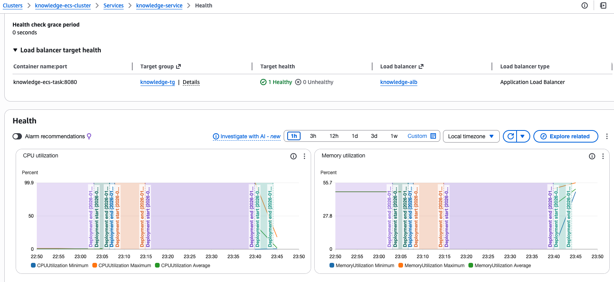
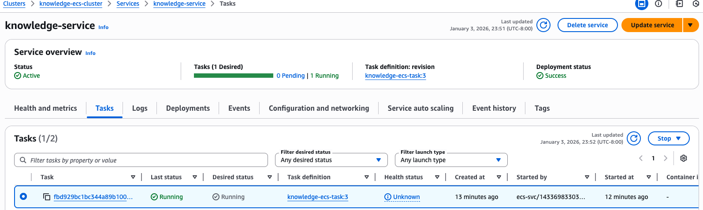
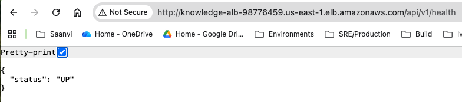
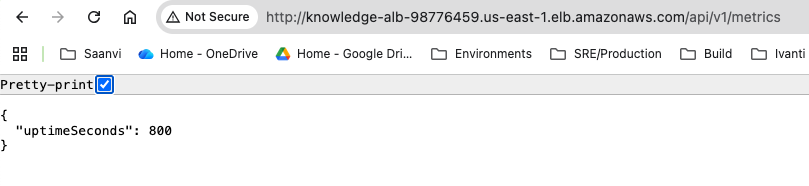
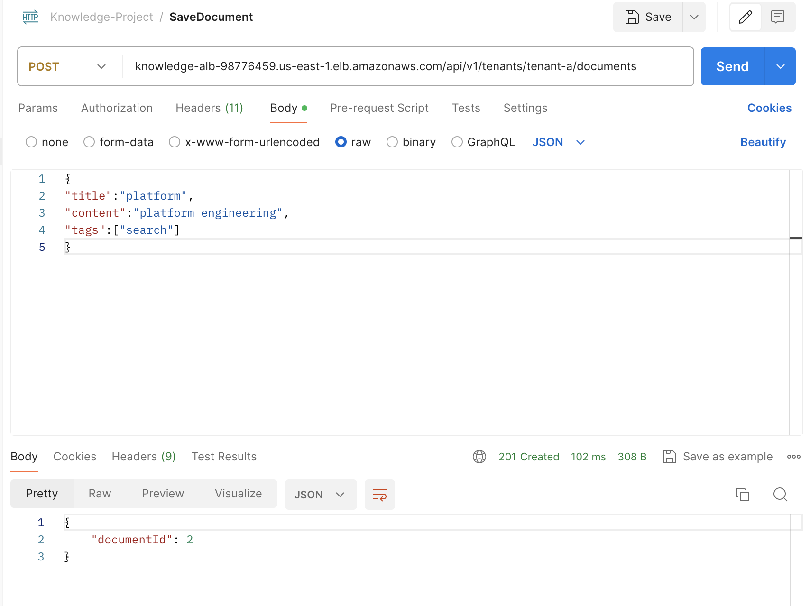

# Knowledge Service AWS Deployment (Terraform)

```bash


Projects
Knowledge-Indexing-Platform\knowledge - a simplied knowledge indexing service developed using Java Spring Boot
Knowledge-Indexing-Platform\knowledge-iac/terraform-aws - terraform infrastrucure code to build an AWS infrastrature and to deploy a docker image.

System Design Document - Knowledge-Indexing-Platform/Docs/SystemDesign.md

```

## Overview
### Knowledge-Indexing-Platform\knowledge
This respository contains a java spring-boot application of the Knowledge Indexing platform, a simplified version covering basic create and search document based out of meta data stored in a local H2 instance. 

### Knowledge-Indexing-Platform\knowledge-iac/terraform-aws
This repository contains Infrastructure-as-Code (Terraform) to deploy the Knowledge Service to AWS using:
- ECS Fargate (compute)
- RDS PostgreSQL (data)
- API Gateway HTTP API + VPC Link + Internal ALB (API front door)
- CloudWatch logs and alarms (monitoring)
- IAM least-privilege roles (security)
- CodeDeploy-based ECS blue/green deployments (deployment strategy)

---

## Prerequisites
- AWS account with permissions for: VPC, ECS, ECR, RDS, API Gateway, IAM, CloudWatch, CodeDeploy
- AWS CLI configured (`aws configure`)
- Terraform >= 1.6
- Docker
- Java build tooling (Maven/Gradle) to build the JAR and image

---

## Setup Instructions
### 1) Build application and Docker image

```bash
cd knowledge
./mvnw clean package
docker build -t knowledge-devprod:1.0.0 .
```
### 2) Deploy infrastructure
```bash
cd ./knowledge-iac/terraform-aws
terraform init
terraform apply
note - will prompt for a DB password
```
```bash
Terraform outputs
ecr_repository_url
api_invoke_url
rds_endpoint

note - use api_invoke_url to access the 'knowledge' application running in aws ecs.
```
### 3) Push image to ECR
```bash
AWS_REGION=us-east-1
ECR_URL=$(terraform output -raw ecr_repository_url)

aws ecr get-login-password --region $AWS_REGION \
 | docker login --username AWS --password-stdin $ECR_URL

docker tag knowledge-devprod:1.0.0 $ECR_URL:1.0.0
docker push $ECR_URL:1.0.0

```
### 4) Roll out service
If enable_blue_green=true, deployments are controlled by CodeDeploy.
Typical pipeline would update the ECS task definition to the new image tag and trigger a CodeDeploy deployment.

For initial validation:

Verify /api/v1/health returns 200 via API Gateway:
```bash
API_URL=$(terraform output -raw api_invoke_url)
curl $API_URL/api/v1/health

```

## How to Run Tests
```bash
cd Knowledge-Indexing-Platform\knowledge
./mvnw test
```
Test layers:
+ Controller tests: MockMvc + disabled security (unit/slice)
+ Service tests: Mockito (no Spring context)
+ Repository tests: @DataJpaTest (H2 for fast validation)

## API Usage Example
### Create Document
```bash
API_URL = localhost:8080
curl -X POST "$API_URL/api/v1/tenants/tenant-a/documents" \
  -H "Content-Type: application/json" \
  -H "X-API-Key: tenant-a-key" \
  -d '{
    "title": "Platform Engineering",
    "content": "Scalable platform architecture patterns",
    "tags": ["platform","engineering"]
  }'
```
### Search Documents
```bash
curl "$API_URL/api/v1/tenants/tenant-a/documents/search?q=platform&limit=10&offset=0" \
  -H "X-API-Key: tenant-a-key"
```

## Scaling Strategy
Compute
+ ECS Fargate service autoscaling based on CPU utilization (target 70%).
+ Stateless services enable horizontal scaling.
+ Set scaling from 2 to 3 on certain CPU and Memory utilization

Data
+ RDS Multi-AZ for HA.
+ Start with vertical scaling; add read replicas if read-heavy.
+ Add indexes for tenantId and createdAt; consider PostgreSQL full-text search if search complexity grows.

API Layer
+ API Gateway supports throttling and request limits.
+ Rate limiting can be implemented at gateway and/or app layer.

## Blue–Green Deployments (ECS + CodeDeploy)
+ Two target groups: blue and green
+ Internal ALB listener shifts prod traffic from blue to green after health checks
+ Auto-rollback on deployment failure
+ Terminates old (blue) tasks after success with a wait window

## Assumptions
+ Single-region deployment
+ Moderate write volume
+ Tenant isolation via logical separation
+ Creeated a docker image of the simplied version of the knowledge indexing service and used that image to deploy in this infrastructure.
    + image has an inbuilt H2 memory. No scaling taken into consideration.
    + Postgres DB is created but not in use
    + Ingest and Search data from H2 database. No vector or index based search
    + A simple algorithm written at the appication level to create score.
+ Secrets stored in Secrets Manager
+ TLS termination occurs at API Gateway

## What I Would Do Differently With More Time

+ Introduce OpenSearch for scalable full-text search
+ Add vector DB and embedded service for vectors.
+ Add OpenTelemetry tracing
+ Canary deployments
+ Multi-region failover
+ Kubernetes and HPA scaling
+ Redis for caching
+ A full CI/CD pipeline for build, scan and deploy, automation and testing
+ Redis integration; currently it is been created but not in use
+ Secured TLS connection with any managed services.

## Images of Knowledge Service running on AWS ECS Instance












